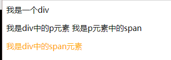
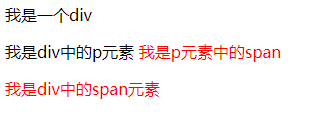

## 子元素选择器
- 选定指定父元素的指定子元素
- 语法：父元素 > 子元素

```css
/*选择器可以混合使用 class为box的div*/
div.box>span{
    color: orange;
}
```

```html
<div class="box">
    我是一个div
    <p>
        我是div中的p元素
        <span>我是p元素中的span</span>
    </p>
    <span>我是div中的span元素</span>
</div>
```
测试结果：



## 后代元素选择器
- 选中指定元素内的指定后代元素
- 语法：祖先 后代

```css
div span {
    color: red;
}
```



```css
div > p > span{
    color: aqua;
}
```

## 兄弟元素选择器
- 选择**下一个**兄弟
- +号连接

```css
/* 紧挨 着p标签的span*/
p + span{
    color: red;
}
```

- 选择下边所有兄弟元素

```css
p ~ span{
    color: yellow;
}
```